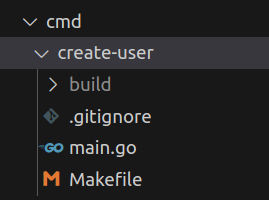

# go-game

A go implementation of a game. For now no real definition of what it is about.

[](https://codecov.io/gh/Knoblauchpilze/go-game)

# Installation

## Pre-requisites

This repository requires (and make use) of the following tools:
- [Go](https://go.dev/doc/install), version 1.20 has been used for development.
- [Postgresql](https://www.postgresql.org/download/linux/ubuntu/)
- [Docker](https://docs.docker.com/engine/install/ubuntu/)
- [Migrate](https://github.com/golang-migrate/migrate/blob/master/cmd/migrate/README.md)

## Code

To clone the repo and build the project from source run:
```bash
git clone git@github.com:Knoblauchpilze/go-game.git
```

Then go to the db creation [section](#interact-with-the-database) and follow the instructions.

Finally go to the root of the repository and run:
```bash
make
```

You can execute the services with:
```bash
make run app_name
```

# Interact with the database

## Attempt with postgres server

We first tried to do it another way than having the database in a docker container. Here are a few links that we gathered:
* This [link](https://www.cherryservers.com/blog/how-to-install-and-setup-postgresql-server-on-ubuntu-20-04) defines how to install postgres and what's installed by default.
* This [link](https://chartio.com/resources/tutorials/how-to-set-the-default-user-password-in-postgresql/) defines how to change the default password for the `postgres` user.
* This [link](https://medium.com/coding-blocks/creating-user-database-and-adding-access-on-postgresql-8bfcd2f4a91e) explains how to create a user and a database.

The issue is that it doesn't seem very clear how to do this in a programmatic way without using the psql shell. Googling yields surprisingly few results, even if it could probably be because the terms were not right.

So in the end we fell back to the database-in-a-container idiom.

## Create the DB container

- Go to [database](database) folder.
- Create the docker image for the database with:
```bash
make docker_db
```
- Run the database container from the image built in the previous step with:
```bash
make create_db
```
- Note that in case a previous operation already succeeded, a container with such a name already exists. To remove it (and then restart to the previous step), one should call:
```bash
make remove_db
```
- Initialize the database by calling the migrate target: this will create the schema associated to the data model of the application and populate the needed fields:
```bash
make migrate
```
- In case a reboot of the system happens, you can restart the db without having to recreate it with the following command:
```bash
make start_db
```

## Iterate on the DB schema

In case some new information needs to be added to the databases one can use the migrations mechanism. By creating a new migration file in the relevant [directory](database/users/migrations) and naming accordingly (increment the number so that the `migrate` tool knows in which order migrations should be ran) it is possible to perform some modifications of the db by altering some properties. The migration should respect the existing constraints on the tables.

Once this is done one can rebuild the db by using the specific [Makefile](database/users/Makefile) target which will only apply the migrations not yet persisted in the db schema with:
```bash
make migrate
```

The migrations are designed in a way that each one can be applied sequentially and can also be rolled back: this is accomplished by having a `XYZ.up.sql` file and a `XYZ.down.sql` file. Any operation performed in the `up` part should have a counterpart in the `down` part to allow a roll back. Typically if a `CREATE TABLE` statement is issued in the `up`, a `DROP TABLE` should be in the `down` file.

## Managing the DB

If the db container has been stopped for some reasons one can relaunch it through the `make start_db` command.

One can also directly connect to the db using the `make connect` command. The password to do so can be found in the configuration files. SQL queries can then be performed in the `psql` editor.

In case a full rebuild of the database container is needed, go to the [database](database) folder: from there and knowing which databse you want to manage do `cd folder/of/yout/database` and proceed to launch the following commands:
```bash
make remove_db
make docker_db
make create_db
make migrate
```

Most of the time though it is sufficient to migrate the database all the way down and rebuild it again with:
```bash
make demigrate
make migrate
```

If all the migrations are correctly set up this will allow to effectively remove all data from the database and start fresh.


# Structure of the project

The repository follows the architecture proposed in the [project-layout](https://github.com/golang-standards/project-layout) github repo.

## pkg

The [pkg](pkg) folder defines the common packages which are meant to be reused by other projects than this repo. Consider it the public interface of what this repo wants to share.

## internal

The [internal](internal) folder defines the packages which are needed by the project but not typically exported or meant to be reused. What should go in `pkg` or `internal` is not always super clear.

## database

The [database](database) folder defines all the information to interact with the databases used by the applications of this repository. This documentation takes the [users](database/users) as an example. We find the configuration files, and the [migrations](database/users/migrations). A [Makefile](database/users/Makefile) allows to easily perform operations on the database.

So far there is only one database, but if needed we could create separate folders for each database, the existing one would serve as a template. More info in the dedicated [section](#interact-with-the-database).

## bin

This folder is empty at first but is meant to receive the result of the compilation of the apps defined in the repository. Using the `install` target in the `Makefile` of each application, one can make it available to be executed at the root level of the repository.

This is made possible by the [run](scripts/run.sh) script and the `make run app_name` target.

## cmd

The [cmd](cmd) contains the list of applications defined in the repository. Each has its own folder and can make use of the packages defined in [pkg](pkg) or [internal](internal).

The template structure is as follows:



A `Makefile` allows to easily compile and execute the application. The logic is created in the `main.go` file and can be extended with additional packages (e.g. by adding a subfolder). The `.gitignore` file allows to not take into consideration the build result.

By default the `Makefile` contains a `install` target which will copy the result of the compilation to be accessible for the whole repo in the [bin](bin) folder.

# Existing packages

## errors

A very important part of the app development is error handling. After a lot of trial and error around this topic, we came up with the concept of an [error with code](pkg/errors/error.go#L10-L12): this is an implementation of the error interface which defines a code. The code is defined in a [table](pkg/errors/errors_table.go) for easy mapping between the error and the cause.

In addition to this the package also defines some utility functions such as `IsErrorWithCode` and various ways to create such an error.

For example, one can create a new error with a code, or wrap an existing error into a new error with code. This allows to easily chain the causes of errors and change the semantic to make it more user-friendly (by for example transforming a raw SQL error into a _User creation failed_ message.)

## rest

When writing a server app, or any app interacting with HTTP requests, we are more often than not trying to access the headers or a request, or its body, or publishing a new response. This is usually very common to have the same code repeated each time it's needed.

The [rest](pkg/rest) package defines utilities to help with this matter. The three main structs are:
* [body](pkg/rest/body.go): defines a way to fetch the body of an [http.Request](https://pkg.go.dev/net/http#Request) and unmarshal it in whatever structure the user provides.
* [header](pkg/rest/header.go): defines a way to get the single/multiple headers defined in a request. Each variant checks that the key exists and that it is unique if needed.
* [response](pkg/rest/response.go): defines manipulation techniques to build a response and fecth data from it. This includes writing a code, adding some details to the [http.Response](https://pkg.go.dev/net/http#Response) and unmarshal the body as any type.

## connection

Another common pain point of creating and manipulating http requests and responses is the creation of said requests. The [connection](pkg/connection) package defines utilities to do just this.

The base building block is the [RequestWrapper](pkg/connection/types.go): this is an abstract representation of a valid request to be executed.

In order to create such a wrapper, we define a [RequestBuilder](pkg/connection/request_builder.go): this element provides utility functions to setup the url, the headers and the body of the request. Depending on the type of request, some info might be ignored (typically the body in a GET request).

Finally the last layer is brought by the individual [post](pkg/connection/post_request.go), [get](pkg/connection/get_request.go), etc. builders: they automatically setup the base `RequestBuilder` in a way that it is already prepared to create the adequate request.

A typical use case is then:
```go
url := fmt.Sprintf("%s/users", serverUrl)

rb := connection.NewHttpPostRequestBuilder()
rb.SetUrl(url)
rb.SetBody("application/json", someInterfaceToMarshalForTheBody)

req, err := rb.Build()
if err != nil {
	return err
}
resp, err := req.Perform()
if err != nil {
	return err
}
```

It makes everything much simpler when building requests.

## db

An important part of this project was to interact with a database to persist information and make it more structured. The goal of the [db](pkg/db) is to provide utilities to interact with any (for now only postgres) databases and seamlessly perform requests to it.

Generally there are three broad categories of elements in this package:
* the interaction with the database itself.
* building and generating SQL queries
* executing the queries and parsing the results

Each of these tasks is handled by building on top of the other layers.

### Low level connection and interaction with the database

This behavior is mainly provided by the [postgres_db](pkg/db/postgres_db.go) file: it builds on top of the [pgxDbFacade](pkg/db/pgx_db_facade.go) and handle connecting/disconnecting/querying the DB. At this point we don't care about verifying that the syntax of the SQL queries is correct or not, we just want to provide a robust environment to execute said queries.

### Building and generating queries

As there are many different kind of queries (`SELECT`, `UPDATE`, `DELETE`), several files are responsible to handle the building of queries. Generally, the approach we followed is to have a builder pattern: we configure the properties of the query, and delegate the generation of the SQL code to those builder. Once the build step is finished, we are certain that we have a valid SQL query (from the syntax perspective) to execute.

Typically, a use case to build a select query could look like so:
```go
qb := db.NewSelectQueryBuilder()

qb.SetTable("table")

qb.AddProp("column1")
qb.AddProp("column2")

q, err := qb.Build()
if err != nil {
  return err
}

fmt.Printf("%s\n", q.ToSql()) // SELECT column1, column2 FROM table
```

This is quite powerful as we separate the generation of the SQL code from the logic using it.

We also introduce the concept of [Filter](pkg/db/filter.go) which more or less maps to `WHERE` clauses. This also uses a builder pattern. We can only add a filter to a query when it has successfully been built. Like so:
```go
fb := db.NewInFilterBuilder()
fb.SetKey("column1")
fb.AddValue("value1")
f, err := fb.Build()
if err != nil {
  return err
}

fmt.Printf("%s\n", f.ToSql()) // WHERE column1 = 'value1'
```

By combining all of that, we can write SQL queries without tinkering too much with how SQL exactly works, at least in the business logic.

### Executing SQL queries and parsing results

Most of the time when executing a query, the user either wants to fetch some data, or to modify the state of the DB. In case some data is expected as a result, there is also most of the time the general expectation of what it will look like: will it contain a single value? Multiple of them?

Depending on the SQL system used under the hood to get the queries, it might be a bit tedious to make sure that the connections to the database are released properly, that the data is correctly unmarshalled and parsed from the SQL data.

In this repository we chose to create a [QueryExecutor](pkg/db/query_executor.go) which should perform all the necessary manipulation to get the data. The general idea is described below:
```go
type rowParser struct {
	value int
}

func (p *rowParser) ScanRow(row db.Scannable) error {
	return row.Scan(&p.value)
}


func foo(db db.Database) error {
  queryExecutor := db.NewQueryExecutor(db)

  var qb QueryBuilder
  scanner := &rowParser{}

  if err := queryExecutor.RunQueryAndScanSingleResult(qb, scanner); err != nil {
    return err
  }

  // Use the value
  fmt.Printf("%d\n", scanner.value)

  return nil
}
```

The logic of querying the database and managing the rows is delegated to the query executor. In this case we expect a single row to be returned, and so we can ask the query executor to make sure that there is only a single row. In case we expect more than one row, we could use the `RunQueryAndScanAllResults` method.

The idea behind this is to decorrelate as much as possible the business logic from the actual implementation of the data storage. By operating on a `Database` interface we are reasonably certain that we could switch the data source to something else relatively easily.

## users

The [users](pkg/users) is responsible to manage everything related to users. A user is a bit of a fuzzy concept but virtually every application where you are expected to register probably has some form of user concept. Our assumption of what a user is is defined [here](pkg/users/user.go).

### Repository

An important concept which we are taking from the [object relational mapping](https://en.wikipedia.org/wiki/Object%E2%80%93relational_mapping) idiom is the [Repository](pkg/users/repository.go).

From the business logic perspective, this is the entry point to the storage system where users are kept. We provided the basic creation/access/deletion methods to interact with users already in the system.

This repository concept is declined in two different kinds:
* a [memory repository](pkg/users/memory_repository.go), where everything is kept in memory.
* a [database repository](pkg/users/db_repository.go), where we reuse what we described about the database interaction to store information in a separate database accessed by the server.

# Executables

While the packages define the logic, putting everything together in executables is what creates an ecosystem to do a task. The goal of this repository is to provide a framework to develop the back-end of a game: to do so we need a server, and service to interact with this.

## Server

This is the main server application, located [here](cmd/server). The basic working principle is as follows:
* instantiate handles, connection to the database and logging.
* listen and serve requests.

For now we only provide the [users](cmd/server/routes/users.go) endpoints. The idea is that as we add more facets to the game, they should be reflected with more routes added to the server, most likely under the [routes](cmd/server/routes) package.

## Adding an executable

In order to make the interaction with the server easier, we also created several small executables to interact with it. In the past, we used to craft http request by hand and then use `curl` to perform them. This is all well and good but lacks a bit of validation and becomes tedious when the requests grow in size (for example creating a specific game object using pre-existing resources with identifiers from the server).

For example, we have an executable to [create a user](cmd/create-user/main.go). We use [cobra](https://github.com/spf13/cobra) to have a cli like interface:
```go
var createCmd = &cobra.Command{
	Use:   "create-user",
	Short: "Create a new user",
	Args:  cobra.RangeArgs(0, 3),
	Run:   createUserCmdBody,
}
```

The call to the server is defined in the `createUserCmdBody` method. This is equivalent to having to do the http request by hand with the added benefit of enjoying a real programming language to perform other requests beforehand or have some validation (for example authentication if needed).

In general, the executable should stay relatively small and help interacting with a specific endpoint of the server.

# Future work

A possible idea would be to replicate more or less what is done in the [sogserver](https://github.com/KnoblauchPilze/sogserver) project.
